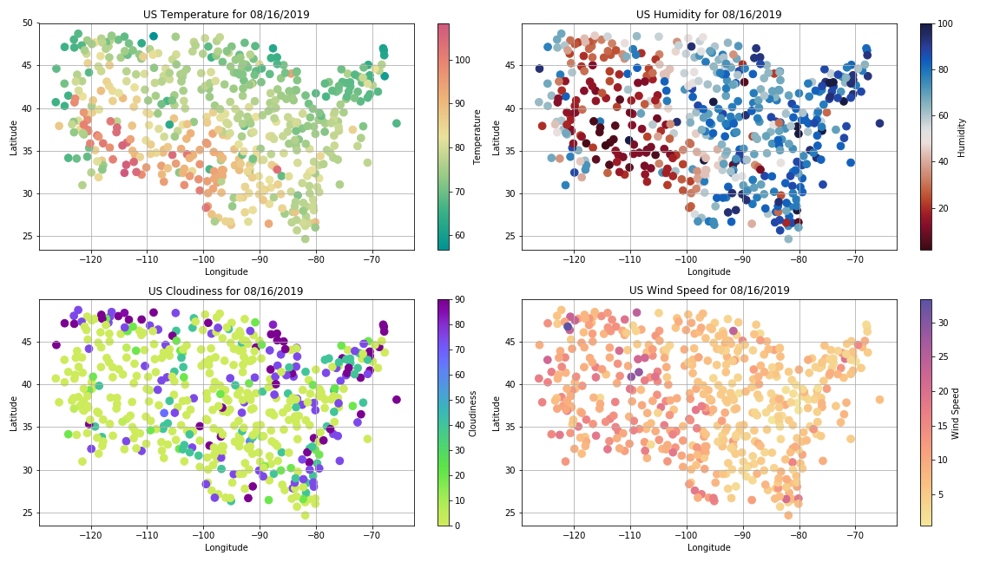
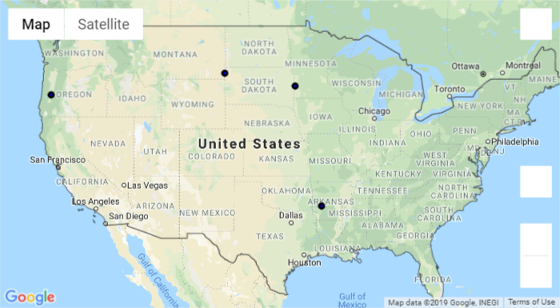

# The Most Comfortable Place in America

I noticed a trend in your 06-Python-APIs homework: Your analysis, the main reason you write all that code, felt like an afterthought. "There appears to be a correlation between latitude and temperature" appeared more than a few times and while it's accurate, you can do better.
 
 
It's up to us to provide you with tools you can use to analyze data but also to provide direction in how to give that analysis depth and context and in that regard, we can do better. _So_, I did the 06-Python-APIs homework again, following the same instructions you were given and only using skills you had at the time of submission. My hope is that you will look at this and see how you color outside the lines and still demonstrate the required skills for future homework assignments.
 

## The Question

---

Every great data story starts with a targeted investigation. I want to know what places in the United States have the perfect weather conditions at any given moment shown in a single visualization. [Storytime](https://github.com/Ouroboros-analytics/Storytime/blob/master/Storytime.ipynb) walks you through my process of achieving that goal.

## Results

---

This is a real time analysis so the results will change based on the weather conditions and season you run the code. The code will always return a map of the areas meeting the criteria of our "ideal" conditions:

- Temperature between 20-25 C (68-77 F)
- Humidity between 40-50%
- Cloud cover between 0-10%
- Wind speed between 0.5-5.5 m/s (1-13 mph)

### Example Result:

---

From all these cities:

To these optimal locations:

**Note**: These locations will be different every time you run the notebook.

## Requirements

---

I have provided the requirements.txt for this notebook if you want to run it on your machine. `cd` into this directory and activate whichever environment you chose (MW: base, TTH: pydata) and run `pip install -r requirements.txt`. It's likely that you will only have to install the `palettable` library but using a requirements file is a good skill to add to your arsenal.
